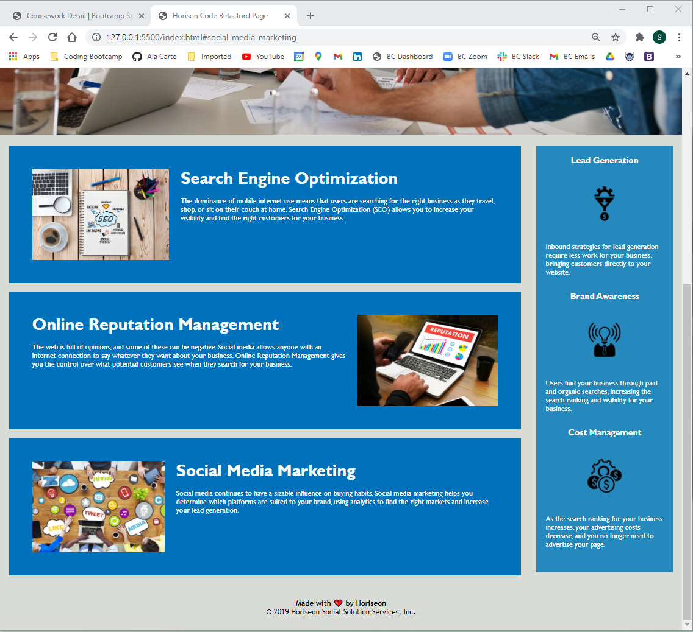

# Title: Code Refactor for Accessibility

<h2>Description:</h2>
<b> What:</b> This project is meant to update the underlying code for this website so that it uses semantic html and improves accessibilty.  

<h2>Links:</h2>
Deployed Application: <a href="https://skyelucking.github.io/01-code-refactor/">https://skyelucking.github.io/01-code-refactor/
 
Git Hub Repo: <a href="https://github.com/skyelucking/01-code-refactor">https://github.com/skyelucking/01-code-refactor</a>

<h2>Screen Shots:</h2>

<b>How:</b> 
<ol>
 <li>  This refactored code has a cleaner underlying code structure for future changes and easy reading. </li>

<li> CSS Classes were consolidated
<li> CSS now has comments
<li> All Links work

 <li>Generic html tags have been replaced with semantic HTML tags and alt text has been included for images</li>
 </ol>
 <b>Why:</b> Both of these were put in place for better accessibilyt and SEO. 

  

<b><color="red"> Now here is your joke...</color></b> 
A man walks into a library and asks the librarian for books about paranoia.  
She whispers, <em>"They're right behind you!</em>

